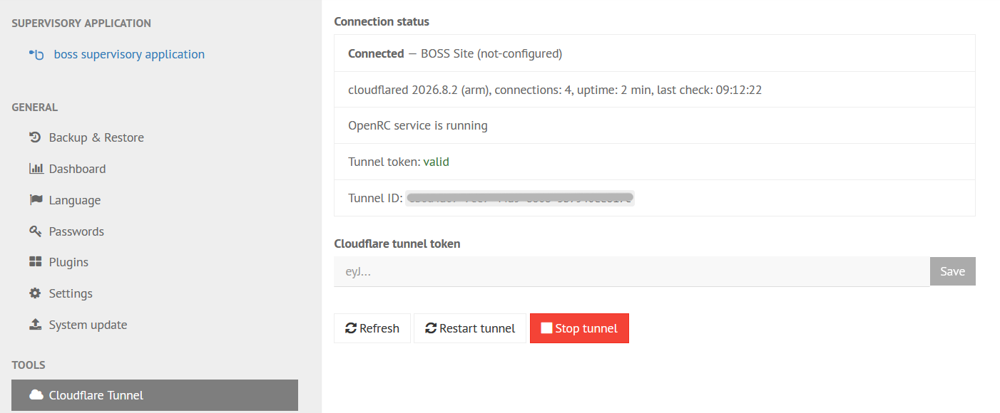
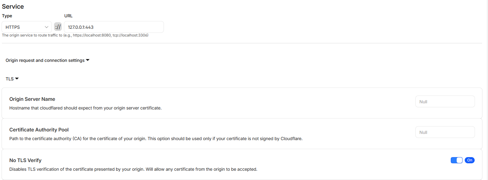

<a id="readme-top"></a>

[![Release][release-shield]][release-url]
[![Release workflow][actions-shield]][actions-url]
[![License][license-shield]][license-url]
[![Issues][issues-shield]][issues-url]

<div align="center">
  <h1>Frigotehnica BOSS Cloudflare Tunnel</h1>

  <p>
    Secure Cloudflare Tunnel installation and management for CAREL BOSS systems.
    <br />
    <a href="https://github.com/frxbg/frigotehnica-boss-cloudflare-tunnel/releases/latest"><strong>Download the latest release</strong></a>
    <br />
    <br />
    <a href="https://github.com/frxbg/frigotehnica-boss-cloudflare-tunnel/issues/new">Report a bug</a>
    &middot;
    <a href="https://github.com/frxbg/frigotehnica-boss-cloudflare-tunnel/issues/new">Request a feature</a>
  </p>
</div>

Current release: `v1.3.5`

<details>
  <summary>Table of contents</summary>
  <ol>
    <li>
      <a href="#about-the-project">About the project</a>
      <ul>
        <li><a href="#features">Features</a></li>
        <li><a href="#architecture-support">Architecture support</a></li>
        <li><a href="#built-with">Built with</a></li>
      </ul>
    </li>
    <li>
      <a href="#getting-started">Getting started</a>
      <ul>
        <li><a href="#prerequisites">Prerequisites</a></li>
        <li><a href="#installation">Installation</a></li>
        <li><a href="#non-interactive-installation">Non-interactive installation</a></li>
        <li><a href="#legacy-ca-certificates">Legacy CA certificates</a></li>
      </ul>
    </li>
    <li>
      <a href="#usage">Usage</a>
      <ul>
        <li><a href="#configure-the-cloudflare-tunnel">Configure the Cloudflare Tunnel</a></li>
        <li><a href="#publish-the-boss-interface">Publish the BOSS interface</a></li>
        <li><a href="#verify-the-connection">Verify the connection</a></li>
        <li><a href="#upgrade">Upgrade</a></li>
        <li><a href="#ajenti-plugin-only-update">Ajenti plugin-only update</a></li>
        <li><a href="#custom-installation">Custom installation</a></li>
        <li><a href="#service-management">Service management</a></li>
        <li><a href="#uninstall">Uninstall</a></li>
      </ul>
    </li>
    <li><a href="#installed-files">Installed files</a></li>
    <li><a href="#security">Security</a></li>
    <li><a href="#roadmap">Roadmap</a></li>
    <li><a href="#contributing">Contributing</a></li>
    <li><a href="#changelog">Changelog</a></li>
    <li><a href="#license">License</a></li>
    <li><a href="#acknowledgments">Acknowledgments</a></li>
  </ol>
</details>

## About the project

Frigotehnica BOSS Cloudflare Tunnel installs the official Cloudflare
`cloudflared` client and a small local management UI on CAREL BOSS devices
running an OpenRC-based embedded Linux system, including Gentoo and Buildroot.

When Ajenti is available, the installer adds **Tools → Cloudflare Tunnel** to
the existing authenticated interface on port `8443`. The management backend
remains bound to `127.0.0.1:9080`, so no additional administration port is
exposed. Systems without Ajenti can use a password-protected standalone panel
on their trusted LAN.

This is an independent community project. It is not affiliated with or
endorsed by CAREL or Cloudflare.

### Features

- One-line installation and upgrade.
- Automatic CAREL BOSS and generic Ajenti detection.
- Native CAREL BOSS Ajenti view with an authenticated API-only proxy.
- Existing Ajenti session authentication; no second login is required.
- Secure tunnel token replacement and connection monitoring.
- Tunnel start, stop, restart, status, uptime, and connection information.
- Official `cloudflared` binaries with pinned SHA-256 verification.
- Non-interactive bootstrap for restricted browser terminals.
- OpenRC boot services, upgrade backups, and safe uninstall.
- Separate Ajenti plugin-only update mode.

### Architecture support

The installer reads `uname -m` and downloads the matching release assets:

| CAREL BOSS type | Detected architecture | Release binary |
| --- | --- | --- |
| Larger BOSS systems | `x86_64` or `amd64` | `frigotehnica-tunnel-ui-linux-amd64` |
| Smaller BOSS systems | `armv7l` or `armv7*` | `frigotehnica-tunnel-ui-linux-armv7` |

ARM devices use the official `cloudflared-linux-armhf` build. Both architecture
variants are built and published by the release workflow.

### Built with

- [Go](https://go.dev/) for the management backend and embedded web UI.
- POSIX shell for installation, upgrades, and removal.
- [Cloudflare Tunnel](https://developers.cloudflare.com/cloudflare-one/connections/connect-networks/)
  for outbound-only remote connectivity.
- Ajenti and AngularJS integration for the authenticated CAREL BOSS view.
- GitHub Actions for tests, cross-compilation, checksums, and release assets.

<p align="right">(<a href="#readme-top">back to top</a>)</p>

## Getting started

### Prerequisites

- CAREL BOSS or compatible embedded Linux device.
- An OpenRC-based embedded Linux system, such as Gentoo or Buildroot.
- ARMv7 hard-float or x86_64/amd64 architecture.
- Root access or a user with `sudo` access.
- Outbound HTTPS and Cloudflare Tunnel connectivity.
- `curl` or `wget`, plus `sha256sum`, `install`, and standard POSIX utilities.
- A remotely managed Cloudflare Tunnel token.
- A Cloudflare account and, when publishing the BOSS interface, a domain active
  on Cloudflare.

### Installation

Run the installer as a user with `sudo` access:

```sh
curl -fsSL https://github.com/frxbg/frigotehnica-boss-cloudflare-tunnel/releases/latest/download/install.sh | sudo sh
```

On CAREL BOSS Micro and other systems with `wget` but no `curl`:

```sh
wget -qO /tmp/frigotehnica-install.sh https://github.com/frxbg/frigotehnica-boss-cloudflare-tunnel/releases/latest/download/install.sh && sudo sh /tmp/frigotehnica-install.sh
```

When already logged in as `root`, omit `sudo`:

```sh
wget -qO /tmp/frigotehnica-install.sh https://github.com/frxbg/frigotehnica-boss-cloudflare-tunnel/releases/latest/download/install.sh && sh /tmp/frigotehnica-install.sh
```

With Ajenti, the installer automatically:

1. Binds Tunnel Control to `127.0.0.1:9080`.
2. Installs the matching CAREL BOSS or generic Ajenti plugin.
3. Uses the existing authenticated Ajenti session.
4. Restarts the detected Ajenti service after installation.

Open Ajenti on port `8443`, select **Tools → Cloudflare Tunnel**, and configure
the Cloudflare tunnel token.

Without Ajenti, the installer asks for the tunnel token and an administrator
password. It detects the LAN address and exposes the standalone panel at:

```text
http://DEVICE_IP:9080
```

### Non-interactive installation

For a restricted CAREL BOSS browser terminal with Ajenti:

```sh
curl -fsSL https://github.com/frxbg/frigotehnica-boss-cloudflare-tunnel/releases/latest/download/install.sh | sudo sh -s -- --non-interactive --ajenti
```

Equivalent command for a `wget`-only CAREL BOSS Micro root shell:

```sh
wget -qO /tmp/frigotehnica-install.sh https://github.com/frxbg/frigotehnica-boss-cloudflare-tunnel/releases/latest/download/install.sh && sh /tmp/frigotehnica-install.sh --non-interactive --ajenti
```

No second login or externally reachable port `9080` is required. After the
installation, open **Tools → Cloudflare Tunnel** and enter the tunnel token.

For a non-interactive standalone installation without Ajenti:

```sh
curl -fsSL https://github.com/frxbg/frigotehnica-boss-cloudflare-tunnel/releases/latest/download/install.sh | sudo sh -s -- --non-interactive --no-ajenti
```

With `wget` and `sudo`:

```sh
wget -qO /tmp/frigotehnica-install.sh https://github.com/frxbg/frigotehnica-boss-cloudflare-tunnel/releases/latest/download/install.sh && sudo sh /tmp/frigotehnica-install.sh --non-interactive --no-ajenti
```

Standalone mode prints a randomly generated one-time UI password. Replace it
on first login. Non-interactive installation never creates an unauthenticated
panel and never uses a shared default password.

### Legacy CA certificates

Some older CAREL BOSS systems cannot validate GitHub's HTTPS certificate
because their CA bundle is outdated. Never pipe an unverified download directly
into a root shell.

The following `v1.3.5` command downloads the installer with legacy TLS mode,
verifies its exact pinned SHA-256 digest, and only then executes it. The verified
installer also checks the downloaded program binaries:

```sh
curl -kfsSL https://github.com/frxbg/frigotehnica-boss-cloudflare-tunnel/releases/download/v1.3.5/install.sh -o /tmp/frigotehnica-install-v1.3.5.sh && echo '5fe4579a97143974763e3c2beeaf1c267c7d39f80c5682e44a5225b313974870  /tmp/frigotehnica-install-v1.3.5.sh' | sha256sum -c - && sudo env FRIGOTEHNICA_INSECURE_DOWNLOADS=yes sh /tmp/frigotehnica-install-v1.3.5.sh --non-interactive --ajenti
```

For a legacy-CA system with `wget` but no `curl`, use:

```sh
wget --no-check-certificate -qO /tmp/frigotehnica-install-v1.3.5.sh https://github.com/frxbg/frigotehnica-boss-cloudflare-tunnel/releases/download/v1.3.5/install.sh && echo '5fe4579a97143974763e3c2beeaf1c267c7d39f80c5682e44a5225b313974870  /tmp/frigotehnica-install-v1.3.5.sh' | sha256sum -c - && env FRIGOTEHNICA_INSECURE_DOWNLOADS=yes sh /tmp/frigotehnica-install-v1.3.5.sh --non-interactive --ajenti
```

The digest is pinned to `v1.3.5` and must not be reused with another release.

<p align="right">(<a href="#readme-top">back to top</a>)</p>

## Usage

Use the Ajenti panel or standalone UI to view tunnel health, replace the token,
and control the `cloudflared` service. Tokens and passwords are never accepted
as command-line arguments.

### Configure the Cloudflare Tunnel

The panel accepts a **remotely-managed Cloudflare Tunnel connector token**. It
does not accept a Cloudflare API token, Global API Key, Tunnel ID, or locally
managed tunnel credentials file.

1. Sign in to the Cloudflare dashboard and open
   **Networking → Tunnels**.
2. Select **Create a tunnel**, enter a descriptive name such as
   `boss-site-name`, and create the tunnel.
3. On the connector setup page, choose a Linux environment. Do not run the
   displayed Cloudflare installation command on the BOSS: this project already
   installs and manages the correct `cloudflared` binary and OpenRC service.
4. Copy only the connector token from the displayed command. It is the long
   value after `--token` and normally begins with `eyJ`.
5. Open the CAREL administration interface on port `8443`, then select
   **Tools → Cloudflare Tunnel**.
6. Paste the connector token into **Cloudflare tunnel token** and select
   **Save**. The panel validates the token, stores it with restricted
   permissions, and restarts the tunnel service.



Cloudflare's current dashboard workflow is documented in
[Create a tunnel (dashboard)](https://developers.cloudflare.com/cloudflare-one/networks/connectors/cloudflare-tunnel/get-started/create-remote-tunnel/).

> [!CAUTION]
> Treat the connector token as a secret. Do not paste it into terminal commands,
> screenshots, issue reports, source control, or chat messages. If it is
> exposed, rotate the tunnel token in Cloudflare and save the replacement in
> the panel.

### Publish the BOSS interface

After the connector becomes healthy, add a route from the public hostname to
the standard BOSS HTTPS interface:

1. In Cloudflare, open **Networking → Tunnels** and select the tunnel.
2. Open **Routes**, select **Add route**, and choose
   **Published application**.
3. Select the public hostname, for example `boss-site.example.com`.
4. Under **Service**, set **Type** to `HTTPS`.
5. Set **URL** to:

   ```text
   127.0.0.1:443
   ```

6. Expand **Origin request and connection settings**, open **TLS**, and enable
   **No TLS Verify**. Leave **Origin Server Name** and
   **Certificate Authority Pool** empty. This is required for the default BOSS
   certificate, which cannot be validated for the loopback address.
7. Save the route. With a full Cloudflare DNS setup, the dashboard creates the
   tunnel DNS record automatically.



See Cloudflare's documentation for
[published application routes](https://developers.cloudflare.com/tunnel/setup/)
and [origin TLS parameters](https://developers.cloudflare.com/tunnel/advanced/origin-parameters/).
Because this route connects `cloudflared` to the BOSS service through the local
loopback interface, the unverified origin TLS hop is not exposed on the LAN or
Internet. The browser-to-Cloudflare connection remains protected by
Cloudflare's edge certificate.

> [!IMPORTANT]
> A published application without an Access policy can be reachable by anyone
> on the Internet. Protect the hostname with a Cloudflare Access self-hosted
> application and an explicit Allow policy for authorized users. Follow
> [Cloudflare's self-hosted application guide](https://developers.cloudflare.com/cloudflare-one/access-controls/applications/http-apps/self-hosted-public-app/).

The Cloudflare route should normally target port `443`, not the Ajenti
administration interface on port `8443`. Keep `8443` limited to a trusted LAN,
VPN, or a separately protected administrative route.

### Verify the connection

Return to **Tools → Cloudflare Tunnel** and select **Refresh**. A healthy
installation should show:

- **Connected**;
- **OpenRC service is running**;
- **Tunnel token: valid**;
- the expected **Tunnel ID**;
- normally four registered Cloudflare connections.

In the Cloudflare dashboard, the same tunnel should become **Healthy**. Finally,
open the configured public hostname in a private browser window and confirm
that Cloudflare Access appears before the BOSS login page.

If the tunnel remains inactive, verify that the BOSS has a default route, DNS
resolution, correct system time, and outbound connectivity to Cloudflare. A
restrictive firewall must permit the connector traffic required by Cloudflare;
refer to the official
[Cloudflare Tunnel troubleshooting guide](https://developers.cloudflare.com/tunnel/troubleshooting/).

### Upgrade

Run the normal installation command again:

```sh
curl -fsSL https://github.com/frxbg/frigotehnica-boss-cloudflare-tunnel/releases/latest/download/install.sh | sudo sh
```

Upgrade from a `wget`-only root shell:

```sh
wget -qO /tmp/frigotehnica-install.sh https://github.com/frxbg/frigotehnica-boss-cloudflare-tunnel/releases/latest/download/install.sh && sh /tmp/frigotehnica-install.sh --non-interactive --ajenti
```

The installer retains the existing configuration, selects the correct ARMv7 or
x86_64 assets, backs up installed program and plugin files, removes stale
Ajenti resources, and restarts the affected services.

### Ajenti plugin-only update

Available in `v1.3.1` and newer. Use this only when Tunnel Control is already
installed and working and only the Ajenti integration needs to be replaced:

```sh
curl -fsSL https://github.com/frxbg/frigotehnica-boss-cloudflare-tunnel/releases/latest/download/install.sh | sudo sh -s -- --plugin-only
```

Plugin-only update from a `wget`-only root shell:

```sh
wget -qO /tmp/frigotehnica-install.sh https://github.com/frxbg/frigotehnica-boss-cloudflare-tunnel/releases/latest/download/install.sh && sh /tmp/frigotehnica-install.sh --plugin-only
```

Plugin-only mode:

- Detects CAREL BOSS or generic Ajenti.
- Backs up and replaces only the Ajenti plugin files.
- Restarts the detected Ajenti service.
- Does not download or replace the Tunnel Control binary or `cloudflared`.
- Does not change the tunnel token, administrator authentication, or OpenRC
  service files.

If the management backend, Ajenti proxy secret, or compatible service
configuration is missing, the command stops and instructs you to run the full
installer.

### Custom installation

```sh
curl -fsSL https://github.com/frxbg/frigotehnica-boss-cloudflare-tunnel/releases/latest/download/install.sh \
  | sudo sh -s -- \
    --listen 192.168.0.177:9080 \
    --site-name "BOSS Test" \
    --hostname boss-test.example.com
```

Use `--ajenti` to require Ajenti integration or `--no-ajenti` to force the
standalone LAN interface. Ajenti mode permits only a loopback listen address.
Run `install.sh --help` for the complete option list.

### Service management

```sh
sudo rc-service cloudflared-frigotehnica status
sudo rc-service cloudflared-frigotehnica restart

sudo rc-service frigotehnica-tunnel-ui status
sudo rc-service frigotehnica-tunnel-ui restart
```

### Uninstall

```sh
curl -fsSL https://github.com/frxbg/frigotehnica-boss-cloudflare-tunnel/releases/latest/download/uninstall.sh | sudo sh
```

The uninstaller retains configuration secrets and logs to avoid accidental
data loss. Review `/opt/frigotehnica` before removing retained data manually.

<p align="right">(<a href="#readme-top">back to top</a>)</p>

## Installed files

```text
/opt/frigotehnica/cloudflared
/opt/frigotehnica/frigotehnica-tunnel-ui
/opt/frigotehnica/config/tunnel.token
/opt/frigotehnica/config/admin.auth
/opt/frigotehnica/config/ajenti-proxy.secret
/opt/frigotehnica/logs/
/etc/init.d/cloudflared-frigotehnica
/etc/init.d/frigotehnica-tunnel-ui
```

Depending on the detected Ajenti variant, one of these plugin directories is
installed:

```text
<AJENTI_SITE_PACKAGES>/ajenti_plugin_frigotehnica/  # generic Ajenti
/home/webui/pvshell-web/plugins/frigotehnica/        # CAREL BOSS
```

<p align="right">(<a href="#readme-top">back to top</a>)</p>

## Security

- Tokens and passwords are never accepted as command-line arguments.
- Interactive secrets are read from `/dev/tty`.
- Standalone non-interactive installs create a unique one-time password.
- Tunnel tokens and password hashes are stored with mode `0600`.
- Ajenti proxy requests require a unique root-owned, restricted secret and a
  loopback source.
- Ajenti validates the active user session before proxying UI requests.
- Ajenti mode binds port `9080` to loopback only.
- The UI does not accept arbitrary shell commands.
- Standalone LAN access uses HTTP and should only be enabled on a trusted
  network.

Never commit tunnel tokens, passwords, customer configuration, CAREL firmware,
or proprietary vendor files.

<p align="right">(<a href="#readme-top">back to top</a>)</p>

## Roadmap

- [x] ARMv7 hard-float support.
- [x] x86_64/amd64 support.
- [x] Authenticated generic Ajenti integration.
- [x] Native CAREL BOSS Ajenti integration.
- [x] Non-interactive and legacy-CA installation modes.
- [x] Ajenti plugin-only updates.
- [ ] Add automated integration tests against representative BOSS firmware
  environments.

See the [open issues](https://github.com/frxbg/frigotehnica-boss-cloudflare-tunnel/issues)
for proposed features and known issues.

<p align="right">(<a href="#readme-top">back to top</a>)</p>

## Contributing

Contributions are welcome. Please avoid committing customer secrets, tunnel
tokens, passwords, proprietary CAREL firmware, or vendor files.

1. Fork the repository.
2. Create a feature branch: `git switch -c feature/your-change`.
3. Test the Go code with `go test ./...`.
4. Check the shell scripts with `sh -n install.sh uninstall.sh`.
5. Commit and push the branch.
6. Open a pull request describing the affected BOSS/Ajenti variant.

<p align="right">(<a href="#readme-top">back to top</a>)</p>

## Changelog

See [CHANGELOG.md](CHANGELOG.md) for release notes and compatibility changes.

<p align="right">(<a href="#readme-top">back to top</a>)</p>

## License

Distributed under the MIT License. See [LICENSE](LICENSE) for details.

<p align="right">(<a href="#readme-top">back to top</a>)</p>

## Acknowledgments

- [Cloudflare](https://www.cloudflare.com/) for `cloudflared` and Cloudflare
  Tunnel.
- [Ajenti](https://ajenti.org/) for the web administration platform.
- [Best README Template](https://github.com/othneildrew/Best-README-Template)
  for the README structure.

<p align="right">(<a href="#readme-top">back to top</a>)</p>

<!-- Reference-style links -->
[release-shield]: https://img.shields.io/github/v/release/frxbg/frigotehnica-boss-cloudflare-tunnel?style=for-the-badge
[release-url]: https://github.com/frxbg/frigotehnica-boss-cloudflare-tunnel/releases/latest
[actions-shield]: https://img.shields.io/github/actions/workflow/status/frxbg/frigotehnica-boss-cloudflare-tunnel/release.yml?style=for-the-badge&label=release
[actions-url]: https://github.com/frxbg/frigotehnica-boss-cloudflare-tunnel/actions/workflows/release.yml
[license-shield]: https://img.shields.io/github/license/frxbg/frigotehnica-boss-cloudflare-tunnel?style=for-the-badge
[license-url]: https://github.com/frxbg/frigotehnica-boss-cloudflare-tunnel/blob/main/LICENSE
[issues-shield]: https://img.shields.io/github/issues/frxbg/frigotehnica-boss-cloudflare-tunnel?style=for-the-badge
[issues-url]: https://github.com/frxbg/frigotehnica-boss-cloudflare-tunnel/issues
